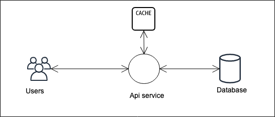

# Laravel cache app

This app uses redis as a cache to store posts, articles and users. For initial requests, as the cache remains empty, we make database calls to fetch the respective entities and put it into the cache. For the subsequent requests, we hit the cache instead of fetching results from database.

# Architecture diagram

In our architecture we have the following components:

[Architecture-Diagram](./diagrams/architecture-diagram.png)

## Api service

This service accepts the api requests and responds with a response. This service is written in Laravel.

## MySQL

This service is our primary database service. We store `users`, `posts` and `articles`inside it.

## Redis cache

This service caches `users`, `posts` and `articles`. 

## Project setup

1. Laravel app can be run by following the steps below:

- Make sure you have mySQL instance up and running
- Perform migration for tables to be worked upon by the command: `php artisan migrate`
- Now once we have our tables created inside MySQL, lets seed some data by the command: `php artisan db:seed`
- Finally run `php artisan serve` to run the development server
- Use the apis to request any entity: GET `http://localhost:8000/api/${user or article or post}` to get data. The response contains a field called `cache_hit`. If `cache_hit` = `true`,  it means we have a response which took the data from our redis cache, if `cache_hit` = `false`, the the response was fetched by making a database call.
- You can make a `PUT` request to perform update operation. During update, we make a database call to update the entity, the we update the cache in redis for the entity in question. This way, we have updated cache as well as primary database.

### Hybrid Dockerized setup

1. Before running Laravel app, do `docker-compose up -d` to run `MySQL` and `Redis` instances.
1. Run Laravel app `php artisan serve`.

## Code paths

The code for seeding data can be found at: 
1. `$PROJECT_ROOT/database/seeds`
1. `$PROJECT_ROOT/database/seedsData`
1. `$PROJECT_ROOT/database/migrations`

Custom service provders registered at: `$PROJECT_ROOT/config/app.php` inside providers array.

Controllers at: `$PROJECT_ROOT/app/Http/Controllers`;

Repositories at: `$PROJECT_ROOT/app/Repositories`;

Services at: `$PROJECT_ROOT/app/Services`

The pattern used here is repository pattern. We have an abstraction for each entity i.e `users`, `articles` and `posts`. Repository classes do the database interaction. Repository implements a contract called `RepositoryContract`. This contract defines what each repository class that implements it should conform to do.

Each repository also includes a `cache service` that is injected by the dependency injector. We are using a singleton cache service instance as of now as it is more tedious to connect to redis on every request. We will instead reuse the same cache service object on every request.

